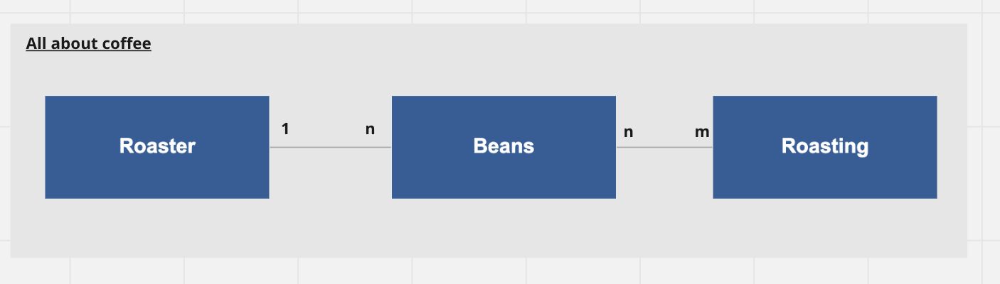

# webeC - Graded Exercise

## Project

Coffee Catalogue 

### Team members

Rudig Milena und Elena Algaria

### Description

#### Idea

Our project is about creating a coffee beans catalogue to find new coffee beans along with your preferences
and the roaster where you can buy them. To collect beans that aren't yet in the catalogue it will be possible to add those too.
We want it to be a responsive design, and it should look pretty, so we will use BEM.

Possible extensions if we have capability:
It would be nice to mark the beans you want to remember and/or to mark if already tasted.

#### Entities

Roaster/ Beans / Roasting




### Extras

* Use of BEM (http://getbem.com/) or another CSS methodology<br />
* Sophisticated and responsive design

## Installation and run instructions

### Run application
Depending on your configuration use the following:

Run the following command with: "Run Anything" console you can access it by pressing two times ctrl.

```
gradle bootRun 
```

Or with the Terminal:
```
./gradlew bootRun 
```

Otherwise, by using the play button in the running application found under [CoffeCatalogue.java](src/main/java/ch/fhnw/webec/coffeecatalogue/CoffeeCatalogue.java)

### Run tests
Run the following command with: "Run Anything" console you can access it by pressing two times ctrl.
```
gradle test 
```
Or with the Terminal:

```
./gradlew test
```
